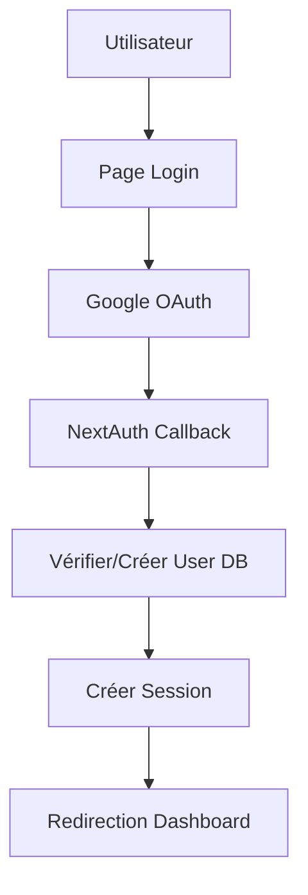

# Architecture Technique Clipbox

## Vue d'ensemble

Clipbox est une plateforme SaaS qui connecte les créateurs de contenu vidéo (YouTubers/Annonceurs) aux clippers (créateurs de contenu court pour TikTok/Instagram). La plateforme facilite la collaboration, la gestion des campagnes et les paiements entre ces deux groupes d'utilisateurs.

## Stack Technique

### Frontend
- **Framework**: Next.js 15.4 avec App Router
- **Langage**: TypeScript
- **Styling**: Tailwind CSS v4
- **UI Components**: Composants custom avec Radix UI pour l'accessibilité
- **State Management**: Zustand pour l'état global + React Context pour l'authentification
- **Internationalisation**: next-intl (FR/EN)
- **Theme**: Support mode sombre/clair avec next-themes

### Backend
- **API**: Next.js API Routes (App Router)
- **Base de données**: PostgreSQL via Supabase
- **ORM**: Prisma
- **Authentification**: NextAuth.js v5 avec Google OAuth
- **File Storage**: Supabase Storage
- **Paiements**: Stripe (abonnements et transactions)
- **KYC**: Veriff API
- **Email**: Resend ou SendGrid

### Infrastructure
- **Hosting**: Vercel (Frontend + API)
- **Database**: Supabase (PostgreSQL)
- **CDN**: Vercel Edge Network
- **Monitoring**: Vercel Analytics + Sentry
- **CI/CD**: GitHub Actions

## Architecture en Couches

### 1. Couche Présentation (UI)
```
src/
├── app/                      # App Router pages
│   ├── [locale]/            # Routes internationalisées
│   │   ├── (auth)/          # Routes authentifiées
│   │   │   ├── dashboard/   # Tableaux de bord par rôle
│   │   │   ├── campaigns/   # Gestion des campagnes
│   │   │   ├── balance/     # Gestion des balances
│   │   │   └── settings/    # Paramètres utilisateur
│   │   ├── (public)/        # Routes publiques
│   │   │   ├── page.tsx     # Page d'accueil
│   │   │   ├── explore/     # Explorer les campagnes
│   │   │   └── pricing/     # Plans tarifaires
│   │   └── (admin)/         # Routes super admin
│   └── api/                 # API Routes
├── components/              # Composants React
│   ├── ui/                 # Composants UI de base
│   ├── features/           # Composants métier
│   └── layouts/            # Layouts réutilisables
└── lib/                    # Utilitaires et logique métier
```

### 2. Couche Logique Métier
- **Services**: Classes pour la logique métier complexe
- **Hooks**: Custom hooks pour la logique réutilisable
- **Validators**: Schémas Zod pour la validation
- **Utils**: Fonctions utilitaires

### 3. Couche Données
- **Prisma Models**: Définition du schéma de base de données
- **Repositories**: Abstraction des opérations de base de données
- **Cache**: Redis via Upstash pour le cache

## Flux d'Authentification

### 1. Inscription/Connexion


### 2. Autorisation par Rôle
- **Clipper**: Accès aux campagnes, soumissions, balance
- **Annonceur**: Création campagnes, gestion budget, validation clips
- **Super Admin**: Accès total, gestion utilisateurs, analytics

## Intégrations Externes

### 1. Stripe
- **Abonnements**: 3 plans (Basic 8€, Pro 20€, GOAT 50€)
- **Webhooks**: Gestion des événements de paiement
- **Connect**: Pour les paiements aux clippers

### 2. Veriff (KYC)
- **Vérification d'identité**: Obligatoire pour les retraits
- **Webhooks**: Mise à jour du statut KYC
- **Documents**: Stockage sécurisé dans Supabase

### 3. APIs Réseaux Sociaux
- **YouTube API**: Récupération des vidéos
- **TikTok API**: Publication et analytics
- **Instagram API**: Publication et analytics

## Gestion d'État

### 1. État Global (Zustand)
```typescript
interface AppState {
  user: User | null
  campaigns: Campaign[]
  notifications: Notification[]
  theme: 'light' | 'dark'
  locale: 'fr' | 'en'
}
```

### 2. État Local
- React Query pour le cache des données serveur
- React Hook Form pour les formulaires
- État local React pour l'UI

## Sécurité

### 1. Authentification
- Sessions JWT sécurisées
- Refresh tokens
- Protection CSRF

### 2. Autorisation
- Middleware de vérification des rôles
- Row Level Security (RLS) Supabase
- Validation côté serveur

### 3. Données
- Chiffrement des données sensibles
- HTTPS obligatoire
- Rate limiting sur les API

## Performance

### 1. Optimisations Frontend
- Code splitting automatique Next.js
- Lazy loading des composants
- Optimisation des images avec next/image
- Prefetching des routes

### 2. Optimisations Backend
- Connection pooling Prisma
- Cache Redis pour les données fréquentes
- Pagination des listes
- Indexes de base de données optimisés

### 3. Optimisations Assets
- CDN pour les assets statiques
- Compression Brotli
- Service Worker pour le cache offline

## Monitoring et Observabilité

### 1. Logs
- Structured logging avec Pino
- Centralisation dans Datadog ou LogTail

### 2. Métriques
- Performance metrics avec Web Vitals
- Business metrics custom
- Alerting sur seuils critiques

### 3. Error Tracking
- Sentry pour les erreurs frontend/backend
- Source maps pour le debugging
- User feedback integration

## Déploiement

### 1. Environnements
- **Development**: Local avec Docker
- **Staging**: Preview deployments Vercel
- **Production**: Vercel avec domaine custom

### 2. CI/CD Pipeline
```yaml
1. Push to GitHub
2. Run tests (Jest, Playwright)
3. Build & Type check
4. Deploy to Vercel
5. Run E2E tests
6. Promote to production
```

### 3. Rollback Strategy
- Instant rollback via Vercel
- Database migrations versionnées
- Feature flags pour les déploiements progressifs

## Scalabilité

### 1. Horizontal Scaling
- Serverless functions auto-scaling
- Database read replicas
- CDN pour la distribution globale

### 2. Vertical Scaling
- Upgrade des plans Supabase/Vercel selon besoins
- Optimisation des requêtes lourdes
- Background jobs avec Vercel Cron

## Conventions et Standards

### 1. Code Style
- ESLint + Prettier configuration
- Conventional Commits
- Code reviews obligatoires

### 2. Documentation
- JSDoc pour les fonctions complexes
- README par module
- Storybook pour les composants UI

### 3. Tests
- Unit tests avec Jest
- Integration tests pour les API
- E2E tests avec Playwright
- Coverage minimum 80%

## Roadmap Technique

### Phase 1 - MVP (Mois 1-2)
- [ ] Authentication & Authorization
- [ ] Dashboard de base par rôle
- [ ] CRUD Campagnes
- [ ] Système de soumission simple
- [ ] Intégration Stripe basique

### Phase 2 - Features Core (Mois 3-4)
- [ ] KYC avec Veriff
- [ ] Système de balance complet
- [ ] Analytics dashboard
- [ ] Notifications temps réel
- [ ] Multi-langue

### Phase 3 - Optimisations (Mois 5-6)
- [ ] Intégrations réseaux sociaux
- [ ] Analytics avancées
- [ ] Système de recommandation
- [ ] Mobile app (React Native)
- [ ] API publique

## Considérations Spéciales

### 1. RGPD Compliance
- Consentement explicite
- Droit à l'oubli
- Export des données personnelles
- Audit trail

### 2. Accessibilité
- WCAG 2.1 Level AA
- Navigation au clavier
- Screen reader support
- Contraste suffisant

### 3. SEO
- Meta tags dynamiques
- Sitemap XML
- Schema.org markup
- Performance optimale

## Conclusion

Cette architecture est conçue pour être scalable, maintenable et évolutive. Elle suit les best practices de l'industrie tout en restant pragmatique pour permettre un développement rapide du MVP.